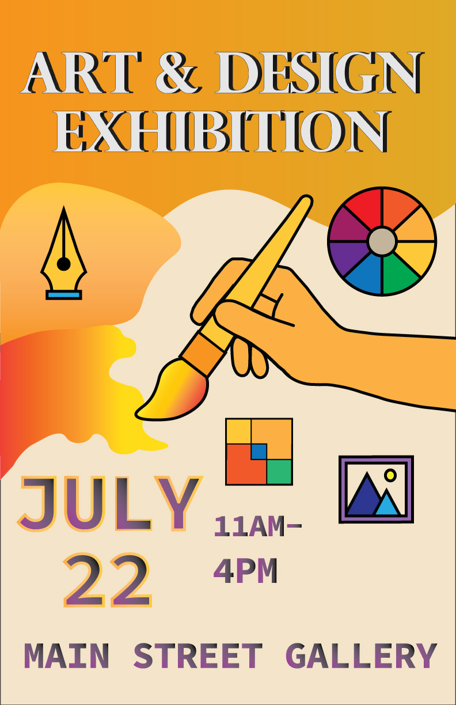

# 👋 Hello, I'm Jesse Foster

🎓 **Graphic Information Technology Student @ ASU**  
💻 **IT Professional | Hardware & Systems Enthusiast**

---

## 👨‍💻 About Me

I currently work in **Information Technology** while attending **Arizona State University**, where I’m pursuing a degree in **Graphic Information Technology**.

After graduation, I plan to continue my IT career with a stronger focus on:
- systems administration  
- technical problem-solving  
- applied design & visualization  

I enjoy working hands-on with technology and learning tools that improve efficiency and usability.

---

## 🛠️ Technical Skills

**Operating Systems**
- Windows 10 / 11
- Windows Server

**IT & Networking**
- Hardware troubleshooting
- System deployment
- Basic networking concepts

**Tools**
- Git & GitHub
- VS Code
- Microsoft Office

---

## 🎮 Interests & Hobbies

- Computer hardware & upgrades  
- Gaming systems (console & PC)  
- Learning new technologies  
- Creative & technical design projects  

---

## 📊 GitHub Activity

---

## 🎨 Sample Work

Below is one of the art/design projects I created while attending ASU:

---

## 🔗 Links

- 🎓 **ASU**: https://www.asu.edu  
- 💼 **LinkedIn**: N/A 
- 🖼️ **Behance**: N/A 

- 🎓 **ASU**: https://www.asu.edu  

---

⭐ *Thanks for visiting my profile!*
